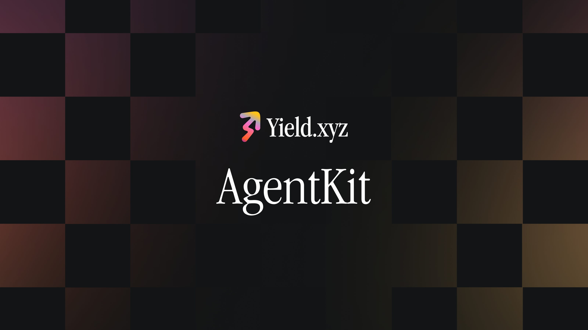

# Yield.xyz AgentKit — Claude Plugin & Skills
[](https://claude.ai/code)
[](https://claude.ai/code)
[](https://github.com/stakekit/agentkit)

The official tooling for Yield.xyz AgentKit — a Claude Code plugin, standalone skills, and connection guides for the Yield.xyz AgentKit MCP Server.

---

## What's in this repo

### Yield.xyz AgentKit Claude Plugins

Five composable plugins in one marketplace. Each installs its skill; the base and builder auto-register the Yield.xyz MCP, and the connectors inherit it from the base (MoonPay additionally needs the MoonPay MCP via guided setup). Start with the base plugin, then add a connector for your wallet/execution provider.

```bash
/plugin marketplace add stakekit/agentkit
```

| Plugin | Install | What it adds |
|---|---|---|
| **`yield-xyz-agentkit`** *(base)* | `/plugin install yield-xyz-agentkit@agentkit` | Discover yields + build transactions, bring your own signer |
| `yield-xyz-agentkit-builder` | `/plugin install yield-xyz-agentkit-builder@agentkit` | Generate Yield.xyz integration code |
| `yield-xyz-agentkit-privy` | `/plugin install yield-xyz-agentkit-privy@agentkit` | Sign + broadcast via Privy agentic wallets |
| `yield-xyz-agentkit-moonpay` | `/plugin install yield-xyz-agentkit-moonpay@agentkit` | Sign + broadcast via MoonPay |
| `yield-xyz-agentkit-robinhood` | `/plugin install yield-xyz-agentkit-robinhood@agentkit` | Discover + act on yields on Robinhood Chain (testnet) — chain config + testnet token funding |

The Privy, MoonPay, and Robinhood Chain connectors **depend on** the base:

```bash
/plugin install yield-xyz-agentkit-privy@agentkit   # also installs yield-xyz-agentkit
```

### Yield.xyz AgentKit Claude Skills

Prefer per-skill installation without the plugin/MCP wiring? Install any skill standalone and pick interactively:

```bash
npx skills add https://github.com/stakekit/agentkit
```

See **[`plugins/README.md`](./plugins/README.md)** for the per-plugin breakdown, individual skill descriptions, and a feature comparison.

---

### Yield.xyz AgentKit MCP Server

The Yield.xyz AgentKit MCP Server exposes a suite of tools that give Claude live access to on-chain yield data, transaction building, and portfolio management across 80+ networks.

**Endpoint:** `https://mcp.yield.xyz/mcp`

### Option 1: Connect via Claude Code

```bash
claude mcp add --transport http yield-xyz-agentkit https://mcp.yield.xyz/mcp
```

### Option 2: Connect via Claude Desktop

Add to `claude_desktop_config.json` (**Settings → Developer → Edit Config**):

```json
{
  "mcpServers": {
    "yield-xyz-agentkit": {
      "command": "npx",
      "args": ["-y", "mcp-remote", "https://mcp.yield.xyz/mcp"]
    }
  }
}
```

→ [Full connection guide and all methods](https://docs.yield.xyz/docs/mcp-server)

---

## Security & custody

Yield.xyz is **SOC 2 compliant** ([trust.yield.xyz](https://trust.yield.xyz)). The agent never takes custody of funds — it only constructs unsigned transactions that your wallet signs and broadcasts.

## Risk Disclosure

Yield.xyz AgentKit is a software tool for discovering yield opportunities and constructing transactions via the Yield.xyz infrastructure. It is not a financial advisor. Nothing in this repository constitutes investment advice or a recommendation to transact in any digital asset.

All actions are initiated at your sole discretion. Digital assets and DeFi involve substantial risk, including potential total loss of funds. Only use funds you can afford to lose.

By using these tools, you acknowledge and accept these risks.

## Resources

- [Yield.xyz AgentKit Docs](https://docs.yield.xyz/docs/agents-overview)
- [MCP Tool Reference](https://docs.yield.xyz/docs/tool-reference)